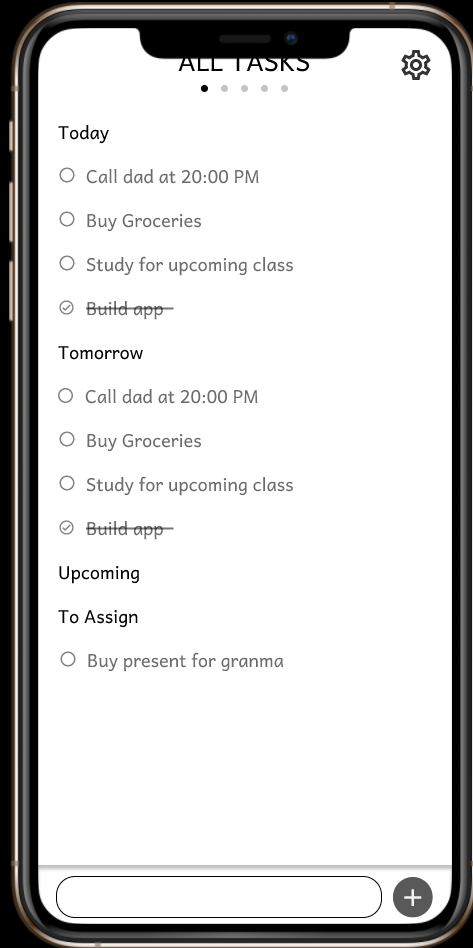

## Idea behind Pseudo-Tasks

<iframe src="https://giphy.com/embed/Ap9iShtkPJpQfYaDAF" width="295" height="480" frameBorder="0" class="giphy-embed" allowFullScreen></iframe>
<a href="https://giphy.com/gifs/Ap9iShtkPJpQfYaDAF">via GIPHY</a>

## Deploy on Vercel

The easiest way to deploy your Next.js app is to use the [Vercel Platform](https://vercel.com/new?utm_medium=default-template&filter=next.js&utm_source=create-next-app&utm_campaign=create-next-app-readme) from the creators of Next.js.

Check out our [Next.js deployment documentation](https://nextjs.org/docs/deployment) for more details.
